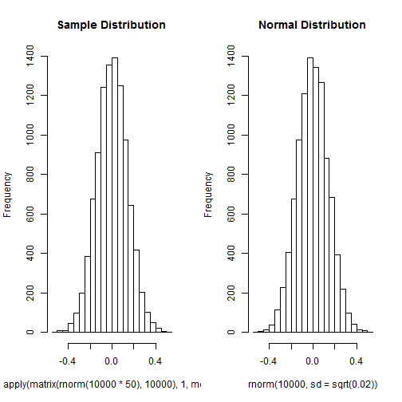

Developing Data Products Course Project Presentation
========================================================
author: Qiushan Sun
date: 1/25/2015

Summary
========================================================

In this course project, we developed a shiny application for the verification of the Central Limit Theorem by demonstrating of the distribution of sample means of which size are chosen by the user. The demonstration shows the 
that:

- The distribution of the samples means approximate normal distribution
- The mean of the sample distribtion approximates 0
- The variance of the sample distribtion approxiamtes the 1 over
size of the sample


Comparing distribution plots
========================================================
The histograms of the distribution of 10000 observations of samples sized 50 and normal distribution of 10000 singl observations of of mean 0 and variance 1/50 are compared: 

 


Sample distribution statistics
========================================================
Sample mean and varaiance for 10000 observations of samples sized 50 can be shown below:


```
[1] -0.001513268
```

```
[1] 0.01992663
```
while the theoretical mean and variance are:


```
[1] 0
```

```
[1] 0.02
```
Conclusion
========================================================
With our shiny application, we verified the central limit theorem in the case of stand normal distribution graphically and numerically.
